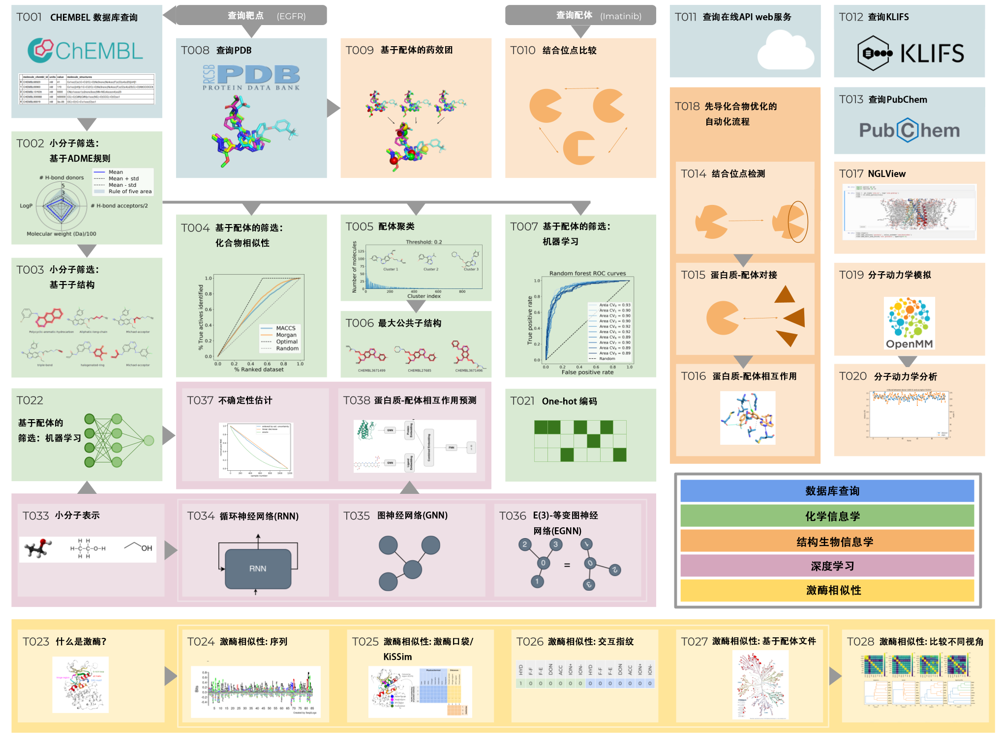

# 动手学CADD(TeachOpenCADD)

使用开源工具包和数据的计算机辅助药物设计(CADD)教学平台

<!-- markdown-link-check-disable-next-line -->

   

> 如果您在出版物中使用了 TeachOpenCADD，请[引用](https://projects.volkamerlab.org/teachopencadd/citation.html)我们！
> 如果您在课堂上使用了 TeachOpenCADD，请包含一个链接回到我们的代码库。
<!-- markdown-link-check-disable-next-line -->
>无论哪种情况，请[star](https://docs.github.com/en/get-started/exploring-projects-on-github/saving-repositories-with-stars)那些您认为对您的学习或教学活动有用的代码库（并告诉您的学生也给它们点赞😄）。

## 概览

  
   
  
  图改编自《TeachOpenCADD》出版物中的Figure 1
  <a href="https://jcheminf.biomedcentral.com/articles/10.1186/s13321-019-0351-x">
  (D. Sydow <i>et al.</i>, J. Cheminformatics, 2019)</a>.
  

开源可编程工具包在化学信息学和结构生物信息学中是强大的工具，它们可以构建模块化、可复现和可重用的计算机辅助药物设计（CADD）流程。尽管这些工具的文档是可用的，但只有少数免费可访问的例子教授以CADD应用为重点的基本概念，特别是针对该领域的新用户。

动手学CADD是一个由学生为学生开发的教育平台，提供以计算机辅助药物设计（CADD）为核心主题的教学材料。由于我们涵盖了这些主题的理论和实践方面，平台面向具有生物学/化学背景以及计算背景的学生和研究人员。

每个主题都通过交互式的 Jupyter Notebook 进行讲解，使用开源包，如 Python包 `rdkit`, `pypdb`, `biopandas`, `nglview`以及 `mdanalysis`等(在 [这里](https://projects.volkamerlab.org/teachopencadd/external_dependencies.html)找到完整列表)。主题正在不断扩展，并对社区的贡献开放。除了教学目的外，动手学CADD材料可以作为用户项目导向修改和扩展的起点。

**版本更新**: 我们已经扩展了动手学CADD平台，新增了6个Notebook，介绍了深度学习及其在与CADD相关主题的应用。

## 让我们开始吧！

<!-- markdown-link-check-disable -->

<!-- markdown-link-check-enable -->

如果您迫不及待地想要阅读项目内容，请访问[这里](https://projects.volkamerlab.org/teachopencadd/talktorials.html)的只读版本。

如果您想执行提供的笔记本，我们提供两种可能性：

在线使用 Binder。这需要大约10分钟准备时间，但不需要您进行任何设置。点击这里开始使用：Binder。一旦加载完成，您可以导航到 teachopencadd/talktorials/ 以找到可执行的笔记本。

本地使用我们的 conda 包。本文档的这一部分有更多详细信息。

<!-- markdown-link-check-disable-next-line -->
- 在线使用 [Binder](https://mybinder.org/)。这需要大约10分钟准备时间，但不需要您进行任何设置。 点击这里使用: . 一旦加载完成，您可以导航到 `teachopencadd/talktorials/`以找到可执行的示例。

- 在本地使用 `conda` 包. 更多细节在: [section of the documentation](https://projects.volkamerlab.org/teachopencadd/installing.html)。

## 动手学CADD KNIME 工作流

<!-- markdown-link-check-disable-next-line -->

如果你更倾向于在图形界面中工作，talktorials T001-T008 也以 [KNIME 工作流](https://hub.knime.com/volkamerlab/space/TeachOpenCADD/TeachOpenCADD)的形式提供。关于这个版本的任何问题，应该在[这篇](https://forum.knime.com/t/teachopencadd-knime/17174)文章的“讨论区”中提出。你需要创建一个 KNIME 账户才能使用论坛。

## 关于动手学CADD

- [联系](https://projects.volkamerlab.org/teachopencadd/contact.html)
- [声明](https://projects.volkamerlab.org/teachopencadd/acknowledgments.html)
- [引用](https://projects.volkamerlab.org/teachopencadd/citation.html)
- [证书](https://projects.volkamerlab.org/teachopencadd/license.html)
- [基金赞助](https://projects.volkamerlab.org/teachopencadd/funding.html)

## 更多资源

请访问我们的动手学CADD官网以获取更多资源:
- [额外的包和网站资源](https://projects.volkamerlab.org/teachopencadd/external_dependencies.html)可以在动手学CADD材料中找到。
- 有关Python编程、化学信息学和结构生物学等的[其他阅读材料](https://projects.volkamerlab.org/teachopencadd/external_tutorials_collections.html)。

## 关于
翻译校对：ByteTora

联系：1224897184@qq.com
