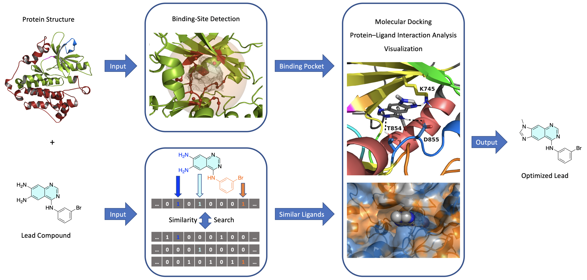

# T018 · 自动化先导化合物优化流程

**注：**此教程是 TeachOpenCADD 的一部分，该平台旨在教授领域特定技能，并提供可作为研究项目起点的流程模板。

作者：

- Armin Ariamajd, 2021, CADD研讨会, 夏里特医学院/柏林自由大学
- Melanie Vogel, 2021, CADD研讨会, 夏里特医学院/柏林自由大学
- Andrea Volkamer, 2021, [Volkamer实验室, 夏里特医学院](https://volkamerlab.org/)
- Dominique Sydow, 2021, [Volkamer实验室, 夏里特医学院](https://volkamerlab.org/)
- Corey Taylor, 2021, [Volkamer实验室, 夏里特医学院](https://volkamerlab.org/)

## 本教程的目标

在本教程中，我们将学习如何开发一个**自动化的基于结构的虚拟筛选流程**。
该流程**特别适用于药物发现项目中的先导化合物扩展和优化**阶段，即一个有前景的配体（如初始命中化合物或先导化合物）需要进行结构修饰以提高其对靶标蛋白的结合亲和力和选择性。该流程的总体架构可总结如下（图1）。

* **输入**
    * 靶标蛋白结构和有前景的配体（如先导或命中化合物），以及需要执行的过程说明。

* **过程**
    * 检测给定蛋白质结构中最具成药性的结合位点。
    * 寻找配体的衍生物和结构类似物，并根据类药性进行筛选。
    * 使用选定的类似物对检测到的蛋白质结合位点进行对接计算。
    * 分析并可视化每个类似物的预测蛋白质-配体相互作用和结合模式。

* **输出**
    * 优化了亲和力、选择性和类药性的新配体结构。

*图1*：自动化基于结构的虚拟筛选流程的总体架构。

### _理论_ 部分内容

- [药物设计流程](#Drug-design-pipeline)
- [蛋白质结合位点](#Protein-binding-site)
- [化学相似性搜索](#Chemical-similarity-search)
- [分子对接](#Molecular-docking)
- [蛋白质-配体相互作用](#Protein&mdash;ligand-interactions)
- [对接结果的可视化检查](#Visual-inspection-of-docking-results)

### _实践_ 部分内容

- [虚拟筛选流程概述](#Outline-of-the-virtual-screening-pipeline)
- [创建新项目](#Creating-a-new-project)
- [输入数据](#The-input-data)
- [处理输入蛋白质数据](#Processing-the-input-protein-data)
- [处理输入配体数据](#Processing-the-input-ligand-data)
- [结合位点检测](#Binding-site-detection)
- [配体相似性搜索](#Ligand-similarity-search)
- [对接计算](#Docking-calculations)
- [蛋白质-配体相互作用分析](#Analysis-of-protein&mdash;ligand-interactions)
- [选择最佳类似物](#Selection-of-the-best-analog)
- [整合所有步骤：全自动流程](#Putting-the-pieces-together:-A-fully-automated-pipeline)

### References

*Note:* due to the extensive references in each category, details are hidden by default.

Click here for a complete list of references.

* **TeachOpenCADD teaching platform**
    
    1. Journal article on *TeachOpenCADD* teaching platform for computer-aided drug design: [D. Sydow *et al.*, *J. Cheminform.* **2019**, 11, 29.](https://doi.org/10.1186/s13321-019-0351-x)
    
    2. [*TeachOpenCADD* website](https://projects.volkamerlab.org/teachopencadd/index.html) at [Volkamer lab](https://volkamerlab.org/)
    
    3. This 教程 is inspired by the *TeachOpenCADD* 教程 T013-T017

    
* **Drug design pipeline**
    
    4. Book on drug design: [*G. Klebe*, *Drug Design*, Springer, **2013**.](https://doi.org/10.1007/978-3-642-17907-5)
    
    5. Review article on early stages of drug discovery: [J. P. Hughes *et al.*, *Br. J. Pharmacol.* **2011**, 162, 1239-1249.](https://doi.org/10.1111/j.1476-5381.2010.01127.x)
    
    6. Review article on computational drug design: [G. Sliwoski *et al.*, *Pharmacol. Rev.* **2014**, 66, 334-395.](https://doi.org/10.1124/pr.112.007336)
    
    7. Review article on computational drug discovery: [S. P. Leelananda *et al.*, *Beilstein J. Org. Chem.* **2016**, 12, 2694-2718.](https://doi.org/10.3762/bjoc.12.267)
    
    8. Review article on free software for building a virtual screening pipeline: [E. Glaab, *Brief. Bioinform.* **2016**, 17, 352-366.](https://doi.org/10.1093/bib/bbv037)
    
    9. Review article on automating drug discovery: [G. Schneider, *Nat. Rev. Drug Discov.* **2018**, 17, 97-113.](https://doi.org/10.1038/nrd.2017.232)
    
    10. Review article on structure-based drug discovery: [M. Batool *et al.*, *Int. J. Mol. Sci.* **2019**, 20, 2783.](https://doi.org/10.3390/ijms20112783)

    
* **Binding site detection**
    
    11. Book chapter on prediction and analysis of binding sites: [A. Volkamer *et al.*, *Applied Chemoinformatics*, Wiley, **2018**, pp. 283-311.](https://doi.org/10.1002/9783527806539.ch6g)
    
    12. Journal article on binding site and druggability predictions using *DoGSiteScorer*: [A. Volkamer *et al.*, *J. Chem. Inf. Model.* **2012**, *52*, 360-372.](https://doi.org/10.1021/ci200454v)
    
    13. Journal article describing the *ProteinsPlus* web-portal: [R. Fahrrolfes *et al.*, *Nucleic Acids Res.* **2017**, 45, W337-W343.](https://doi.org/10.1093/nar/gkx333)
    
    14. [*ProteinsPlus* website](https://proteins.plus/), and information regarding the usage of its *DoGSiteScorer* [REST-API](https://proteins.plus/help/dogsite_rest)
    
    15. *TeachOpenCADD* 教程 on binding site detection: [教程 T014](https://projects.volkamerlab.org/teachopencadd/talktorials/T014_binding_site_detection.html)
    
    16. *TeachOpenCADD* 教程 on querying online API web-services: [教程 T011](https://projects.volkamerlab.org/teachopencadd/talktorials/T011_query_online_api_webservices.html)

    
* **Chemical similarity search and molecular fingerprints**
    
    17. Review article on molecular similarity in medicinal chemistry: [G. Maggiora *et al.*, *J. Med. Chem.* **2014**, 57, 3186-3204.](https://doi.org/10.1021/jm401411z)
    
    18. Review article on molecular fingerprint similarity search: [A. Cereto-Massague *et al.*, *Methods* **2015**, 71, 58-63.](https://doi.org/10.1016/j.ymeth.2014.08.005)
    
    19. Review article on molecular fingerprints in virtual screening: [I. Muegge *et al.*, *Expert Opin. Drug Discov. **2016**, 11, 137-148.](https://doi.org/10.1517/17460441.2016.1117070)
    
    20. Journal article on extended-connectivity fingerprints (ECFPs): [D. Rogers *et al.*, *J. Chem. Inf. Model.* **2010**, 50, 742-754.](https://doi.org/10.1021/ci100050t)
    
    21. Journal article on *Morgan* algorithm: [H. L. Morgan, *J. Chem. Doc.* **2002**, 5, 107-113.](https://doi.org/10.1021/c160017a018)
    
    22. Journal article on Molecular ACCess Systems (MACCS) keys fingerprint: [J. L. Durant *et al.*, J. Chem. Inf. Comput. Sci. **2002**, 42, 1273-1280.](https://doi.org/10.1021/ci010132r)
    
    23. Journal article describing the latest developments of the *PubChem* web-services: [S. Kim *et al.*, *Nucleic Acids Res.* **2019**, 47, D1102-D1109.](https://doi.org/10.1093/nar/gky1033)
    
    24. [*PubChem* website](https://pubchem.ncbi.nlm.nih.gov/), and information regarding the usage of its [APIs](https://pubchemdocs.ncbi.nlm.nih.gov/programmatic-access)
    
    25. Description of *PubChem*'s [custom substructure fingerprint](https://ftp.ncbi.nlm.nih.gov/pubchem/specifications/pubchem_fingerprints.pdf) and [*Tanimoto* similarity measure](https://jcheminf.biomedcentral.com/articles/10.1186/s13321-016-0163-1) used in its similarity search engine.  
    
    26. *TeachOpenCADD* 教程 on compound similarity: [教程 T004](https://projects.volkamerlab.org/teachopencadd/talktorials/T004_compound_similarity.html)
    
    27. *TeachOpenCADD* 教程 on data acquisition from *PubChem*: [教程 T013](https://projects.volkamerlab.org/teachopencadd/talktorials/T013_query_pubchem.html)
    
    
* **Chemical drug-likeness**
    
    28. Review article on drug-likeness: [O. Ursu *et al.*, *Wiley Interdiscip. Rev.: Comput. Mol. Sci.* **2011**, 1, 760-781.](https://doi.org/10.1002/wcms.52)
    
    29. Editorial review article on drug-likeness: [*Nat. Rev. Drug Discov.* **2007**, 6, 853.](https://doi.org/10.1038/nrd2460)
    
    30. Review article on physical and chemical concepts behind drug-likeness: [M. Athar *et al.*, *Phys. Sci. Rev.* **2019**, 4, 20180101.](https://doi.org/10.1515/psr-2018-0101)
    
    31. Review article on available online tools for assessing drug-likeness: [C. Y. Jia *et al.*, *Drug Discov. Today* **2020**, 25, 248-258.](https://doi.org/10.1016/j.drudis.2019.10.014)
    
    32. Journal article on Lipinski's rule of 5: [C. A. Lipinski *et al.*, *Adv. Drug Delivery Rev.* **1997**, 23, 3-25.](https://doi.org/10.1016/S0169-409X(96)00423-1)
    
    33. Short review on re-assessing the rule of 5 after two decades: [A. Mullard, *Nat. Rev. Drug Discov.* **2018**, 17, 777.](https://doi.org/10.1038/nrd.2018.197)
    
    34. Journal article on the Quantitative Estimate of Druglikeness (QED) method: [G. Bickerton *et al.*, *Nat. Chem* **2012**, 4(2), 90-98.](https://www.ncbi.nlm.nih.gov/pmc/articles/PMC3524573/)
    
    35. [*RDKit* documentations](https://www.rdkit.org/docs/source/rdkit.Chem.QED.html) on calculating QED.
    

* **Molecular docking**
    
    36. Review article on molecular docking algorithms: [X. Y. Meng *et al.*, *Curr. Comput. Aided Drug Des.* **2011**, 7, 146-157.](https://doi.org/10.2174/157340911795677602)
    
    37. Review article on different software used for molecular docking: [N. S. Pagadala *et al.*, *Biophys. Rev.* **2017**, 9, 91-102.](https://doi.org/10.1007/s12551-016-0247-1)
    
    38. Review article on evaluation and comparison of different docking programs and scoring functions: [G. L. Warren *et al*, *J. Med. Chem.* **2006**, 49, 5912-5931.](https://doi.org/10.1021/jm050362n)
    
    39. Review article on evaluation of ten docking programs on a diverse set of protein-ligand complexes: [Z. Wang *et al.*, *Phys. Chem. Chem. Phys.* **2016**, 18, 12964-12975.](https://doi.org/10.1039/C6CP01555G)
    
    40. Journal article describing the *Smina* docking program and its scoring function: [D. R. Koes *et al.*, *J. Chem. Inf. Model.* **2013**, 53, 1893-1904.](https://doi.org/10.1021/ci300604z) 
    
    41. [*OpenBabel* documentation](http://openbabel.org)
    
    42. [*Smina* documentation](https://sourceforge.net/projects/smina/)
    
    43. *TeachOpenCADD* 教程 on protein–ligand docking: [教程 T015](https://projects.volkamerlab.org/teachopencadd/talktorials/T015_protein_ligand_docking.html)
    
    
* **Protein-ligand interactions**
    
    44. Review article on protein-ligand interactions: [X. Du *et al.*, *Int. J. Mol. Sci.* **2016**, 17, 144.](https://doi.org/10.3390/ijms17020144)
    
    45. Journal article analyzing the types and frequencies of different protein-ligand interactions in available protein-ligand complex structures: [R. Ferreira de Freitas *et al.*, *Med. Chem. Commun.* **2017**, 8, 1970-1981.](https://doi.org/10.1039/C7MD00381A)
    
    46. Journal article describing the *PLIP* algorithm: [S. Salentin *et al.*, *Nucleic Acids Res.* **2015**, 43, W443-447.](https://doi.org/10.1093/nar/gkv315)
    
    47. [*PLIP* website](https://plip-tool.biotec.tu-dresden.de/plip-web/plip/index)
    
    48. [*PLIP* documentation](https://github.com/pharmai/plip)
    
    49. *TeachOpenCADD* 教程 on protein-ligand interactions: [教程 T016](https://projects.volkamerlab.org/teachopencadd/talktorials/T016_protein_ligand_interactions.html)

    
* **Visual inspection of docking results**
    
    50. Journal article describing the NGLView program: [H. Nguyen *et al.*, *Bioinformatics* **2018**, 34, 1241-1242.](https://doi.org/10.1093/bioinformatics/btx789)
    
    51. [*NGLView* documentation](http://nglviewer.org/nglview/latest/api.html)
    
    52. *TeachOpenCADD* 教程 on advanced NGLView usage: [教程 T017](https://projects.volkamerlab.org/teachopencadd/talktorials/T017_advanced_nglview_usage.html)
    

